##### Imperial College London, Department of Electrical & Electronic Engineering


#### ELEC70142 Digital VLSI Design

### Lab 2 - Understanding and Editing Layout

##### *Peter Cheung, v1.0 - 9 October 2025*

---
### Objectives
---
By the end of this laboratory session, you should be able to do the following.
* Understand the different mask layers that make up the layout of an inverter.
* Manually extract the circuit schematic of a 12-transistors logic gate from its layout.
* Import a Verilog netlist into Virtuoso as a schematic.
* Use Cadence's Virtuoso tool package to perform floorplanning and placement.
* Use Cadence's Virtuoso tool package to perform routing.
* Use Cadence's Calibre tool package to verify that your layout obeys design rules through DRC.
* Use Cadence's Calibre tool package to verify that your layout is the same as the schmatic.

---
### Task 1 - Deep Dive into Inverter Layout (30 minutes)
---
The purpose of this task is for you to understand the different mask layers that make up a simple inverter from the layout.  This helps you to appreciate the fabrication process and the physical aspect of VLSI design.

**_Step 1: Launch Virtuoso_**

Log onto the teaching server ee-mill1 or ee-mill2 (depending on your group number), and set up the technology with **_pdk tsmc65LP_** as before.

Navigate to the same folder that contains Lab 1's design. Launch Virtuoso layout editor in the background by typing:
```bash
cadence&
```
A Virtuoso message window will appear. You are now runnig the Cadence Virtuoso package in the background.

**_Step 2: Fetch the inverter standard cell from library_**

Go  to the Virtuoso message window and click **_Tools -> Library Manager ..._**.  
<p align="center"> 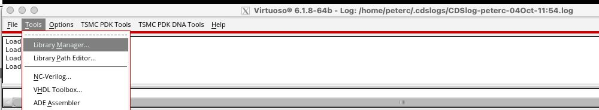 </p><BR>

Select the TSMC's **_tcbn65lpbwp7t_9lm_** library.

>**TSMC process library naming convention:** 
> * **_tc_** - technology characterisation
> * **_bn65_** - 65nm standard cell library
> * **_lp_** - low power option
> * **_bwp7t_** - bulk CMOS (bw), low threshold voltage (p) and 7-track height
> * **_9lm_** - 9 layers of metal

<p align="center">  </p><BR>

**_Step 3: Examine mask layers for the inverter_**

From the list of standard cells in this technology library will appear. Select **_INVD0BWP7T_**.  This is one of the cells used in the LFSR4 circuit in Lab 1.

>**TSMC standard cell naming convention:** 

> * **_INV_** - inverter cell
> * **_D0_** - lowest output current capability (D6 is highest)
> * **_BWP7T_** - bulk CMOS (bw), low threshold voltage (p) and 7-track high cell library (7t)

Double click the **_layout_** view on right most pane to view the layout of this inverter standard cell.  (See diagram above.) You can also use the shortcut command **_"f"_** to fit the entire layout in the window.

Examine the different mask layers that are used to fabricate this inverter by doing the following:
1. The layout cellview window shows the inverter standard cell layout. On the left are ALL the mask layers associated with this fabrication process. There are more than 50 masks include!  Examine them briefly and see if you can spot some of them that you can recognise.
2. Click on **_Used_** tick box at the top to show ONLY the masks layers that are used in the design of this standard cell.  (See diagram below.)
3. Click on **_V_** (red circle) to turn OFF all layers.
4. From top to bottom, turn on one layer at a time and observe how the inverter cell is "constructed".
   
Discuss with your partner what you understand from this exercise.

<p align="center"> 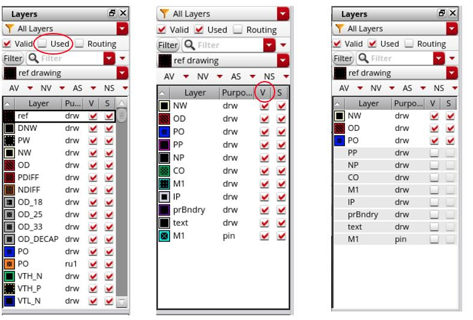 </p><BR>

> **Name of the mask layers:**
> * NW - N-well
> * OD - oxide diffusion region, also called Active mask
> * PO - polysilicon gate
> * PP - p-type diffusion
> * NP - n-type diffusion
> * CO - contact
> * M1 - metal 1 
> * prBndry - boundary of the standard cell where it is joint to the next cell
> * text - text label for this cell (i.e. cell name)
> * M1 - cell input output pin locations on metal 1


### Task 2 - Extract Circuit from Layout (40 minutes)

The goal of this task is for you to learn how to intepret a layout and re-create the transistor schematic of a 12-transistors standard cell.

**_Step 1: Load the XOR gate standard cell_**

If the Library Manager window is not open, open it from the Virtuoso message window with: **_Tools -> Library Manager ..._**.

In the Library Manager window, select the XOR gate standard cell **_CKXOR2D0BWP7T_**.

> CKXOR2 - clock optimized 2-input XOR gate

Open the layout of this standard cell by double-clicking on **_layout_** view.  Use the **_"f"_** command to fit the layout within the window.

**_Step 2: Extract the circuit schematic from the layout_**

You and your lab partner are now required to extract from this layout all the transistors. Then connect them together to produce a transistor level schematic diagram.  You should label all transistors in the top row from left to right with **_odd_** designations (i.e. T1 to T11), and the bottom row with **_even_** designations (T2 to T12).  Put the schematic circuit diagram in your logbook.

**_Step 3: Sizing the transistors_**

* With the  **_"k"_** command, measure the **sizes** (i.e. widths) of all transistors and annotate them on your schematic.
* Check with another group near you whether you have the same circuit as they do.  
* Satisfy yourself that this cicuit fulfils the logic function of a 2-input XOR gate.

> You can remove the measurements and rulers with the **_SHIFT-k_** command.

### Task 3 - Hand Place the standard cells (45 min)

The purpose of this task is for you to learn how to use Virtuoso for **layout editing**.  While you will not be designing layout of a gate from transistor up, you will still need to learn how to wire up synthesize, placed and routed modules and connect them to the pad ring.

The goal of this task is for you to take the Verilog netlist from Lab 1 and manually place them as a row of cells and connect the cells into the LFSR4 circuit.

**_Step 1: Set up the LAB_2 folder as a new library (i.e. project)_**

Before we start layout editing, we need to create a project (called a **_library_** in Cadence parlance) for this exercise. 

Create the project folder by:

*   Navigate to **_File -> New -> Library_**.
*   Name the library (say as LAB_2) and tick the **_"Attached to an existing technology library"_** radio button and click **Apply**.
*   In the pop-up window, select **_tsmcN65_** and click **Apply**.

<p align="center"> 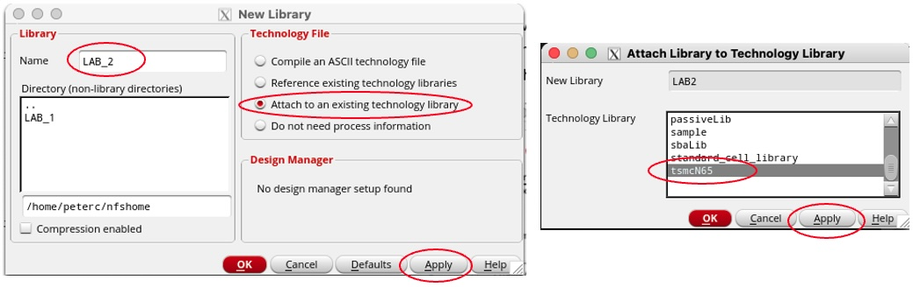 </p><BR>

>What you have just done was to create a directory called **LAB_2** in your **_pwd_** (present working directory), initialize it for a   design called **LAB_2**, and specify that the technology is **_tsmcN65_**.

If you use **_ls -l_** unix command in the terminal window to examine what has been created, you will see that LAB_2 folder with Cadence generated files ready to create a new layout in the TSMC 65nm process.

Copy from LAB_1/OUTPUTS folder, the synthesized and placed-and-routed netlist for LFSR4 to the LAB_2 folder:

```bash
cp ../LAB_1/OUTPUTS/lfsr4_soc.v .
```

**_Step 2: Import the synthesized LFSR4 circuit into Virtuoso_**

In the Virtuoso message window, use **_file -> import -> verilog_** command to open a Verilog import dialog window as below.

<p align="center"> 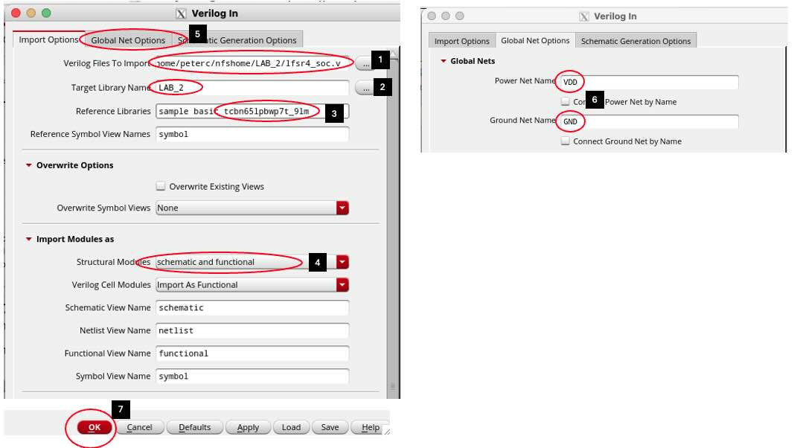 </p><BR>

To successfully important the Verilog netlist from Lab 1, follow the steps below as show in the diagram above:
1. Use the browser button, select the netlist file **_lfsr4_soc.v_**.
2. Set **LAB_2** (or whatever name you call this folder) as the target library (project) to be stored.
3. Add into the **reference library** list the technology file we are using. This contains information about the standard cells.
4. Specify that you can to important this Verilog netlist as both **schematic and functional**.  This allows for Layout vs Schematic verification later.
5. Now go to **_"Global Net Options"_** menu at the top to change the dialogue box contents.
7. Remove the "!" characters in the power net names to "VDD" and "VSS".
8. Click OK to important the Verilog netlist and generate a schematic diagram.
    
9.  Use the "f" short-cut to fit the entire schematic in the newly opened window.

You should see the schematic circuit for the PnRed LFSR4 module from Lab 1 as below.
   
<p align="center"> 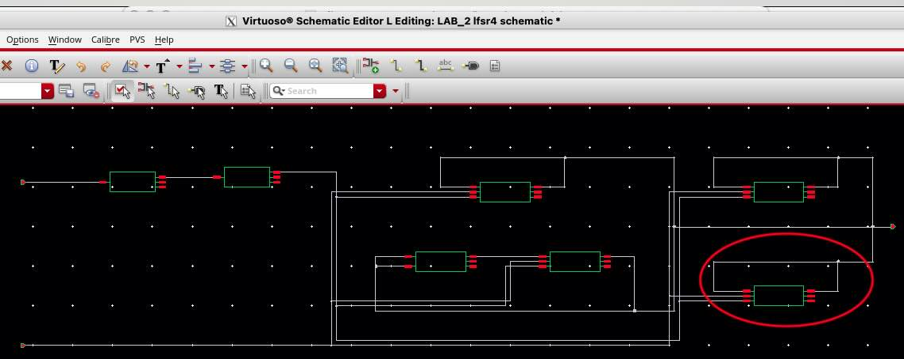 </p><BR>

>You can zoom in and out of the schematic at the pointer location using scroll wheel of the mouse. 
>You can also pan across the schematic by click and hold the scroll button and drag the mouse.

Zoom into the bottom right component on the schematic as indicated above.  You will see the MSB D-FF of the LFSR *_sreg_reg[4]_*.  All the connections are automatically wired except for VDD and VSS. This is because the Verilog netlist does not include these signals.

<p align="center"> 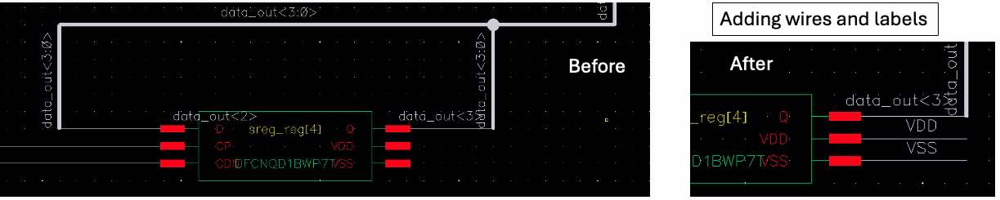 </p><BR>

**_Step 4: Add VDD and VSS connection to the schematic_**

We now need to tell the schematic about the VDD and VSS connections. 
* Use the "w" or wire shortcut, and "draw" two horizontal wires from VDD and VSS by right-click at start and end of wire. Use ESC to terminate each wire.
* Use the "l" or label shortcut, and enter VDD as label, and click on the wire to be labelled. So the same for VSS.
* Repeat this on all components.
  
>A quicker way to do this is to select the two wires and their labels, use "c" shortcut to cut the entire group and click at a new location to paste.  Try this yourself.
>If you make a mistake, you can use the **_"u"_** undo shortcut to undo your previous actions.

Once you have added the VDD and VSS wires to all components, click the **_check and save_** icon (third from the left with a green tick).  You will see one warning.  The warning is because the imported schematic created a cross connection at the output.  You can more the output cross wire down a bit to form a T-junction and not a cross junction. When you **_check and save_** again, the warning will disappear and the schematic is now correct nad ready to be used a reference for LVS verification later.

>We know the circuit represented by the schematic is a faithful representation of the intended circuit because it was generated from a simulated netlist from Lab 1.

**_Step 4: Preparation for manual layout of standard cells_**

The next step is to create a layout view of the LFSR4 circuit.  
1. In the main message window, create a new layout design with: **_File -> New -> Cellview_**.
2. In the **_"New File"_** window, specify details about this new layout file according to the diagram below.
3. In the new layout window, import the standard cells in the schematic with: **_Connectivy -> Generate -> All from Source ..._**. (See diagram below.)

<p align="center"> 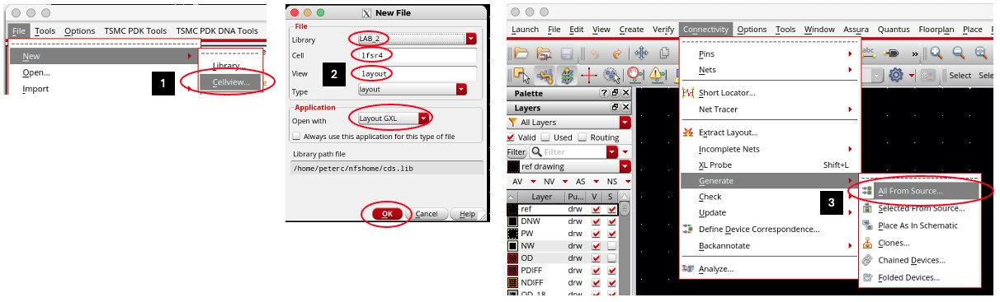 </p><BR>

4. A **_"Generate Layout"_** dialogue box will pop up. Select the **_I/O pin_** section at the top of the window as shown in diagram below. This is to tell the layout which layer I/O pin of the standard cells are on.
5. Select **M1** to specify that all I/O pin are on metal 1 layer.
6. Click the **_"Create Label as"_** radio button and then click **_"Option"_**.
7. Another window called **_"Set Pin Label"_** dialogue box will pop up.  Select both **_"Same As Pin"_** button.
8. Click the two **_"OK"_** buttons.

<p align="center"> 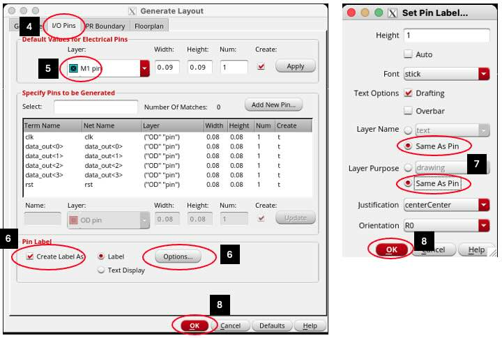 </p><BR>

After  these steps, you should see a new layout window pop up with a purple box at the top and all 7 standard cell instances inserted on the layout canvas as bounding rectangles.

**_Step 5: Floorplanning_**

The goal of this step is to arrange the cells in a rough floorplan as shown in the diagram below.  The rationale is that the inputs signals are on the left, the outputs are on the right. The cells are placed such that their output pins are close to the input pins to which they are connected.

<p align="center"> 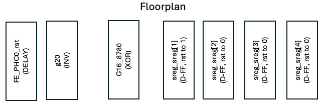 </p><BR>

Before we can move the standard cells to match this floorplan, we need to do three preliminary steps:
1. **Arrange the schematic and layout windows** - resize and move the schematic and layout windows side by size. The layout window should be wider. If you now select a cell in one window, it will be highlighted on the other window.  In this way, you can identify which component is which.
2. **Change the PnR boundary** - Click on the purple bounding box (which will turn yellow) and use the **_"q"_**  command to bring up the **_"Edit PR Boundary Property"_** dialogue box.  Change the bounding box coordinate to (0 0) (0 5) (35, 5) (35, 0).
3. **Set snap grid to 5nm** - **_Use Option -> Display_** (or the "e" command) to bring up the **_"Display Option"_** dialogue box and change the X and Y snap spacing to 0.005.

<p align="center"> 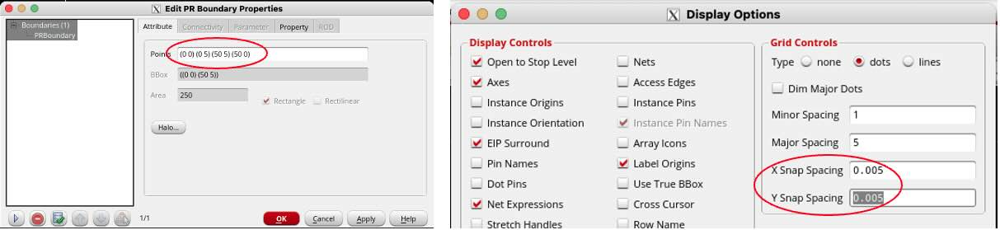 </p><BR>

Select one cell at a time and drag and place it inside the PnR area (purple box) according to the floorplan diagram shown earlier. 

>Note that you can only move a component horizontally and then vertically in two separate steps, but not diagonally.

We next expose the actual layout of the cells with the **_"SHFIT-f"_** command.  
The result of this floorplanning step is shown in the diagram below.

<p align="center"> 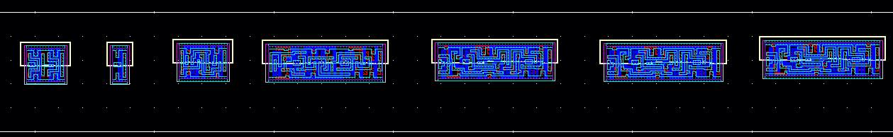 </p><BR>

**_Step 6: Manual Placement_**

The next step is to place each cell at the final precise location. This action needs to be extrememly precise and require you to use the mouse to enlarge the layout so that all geometric feature is clearly seen.  

The most useful command here is **"a"**, the align command.  Let us now place the left-most cell (the delay cell) abutting the inverter cell:
1. Zoom into the top right corner of the left-most cell with the mouse scroll wheel while the cursor is at the location you want to zoom.
2. Select the left-most cell (delay). **_The cell will be highlighted in a **WHITE** bounding box_**.
3. Press **"a"** command. The curson now has an alignment icon attached to it. You are now in **_alignment mode_**.
4. Click on the **_bottom edge_** of the metal 1 VDD wire of the delay cell (which will be highlighted).
5. Click on the bottom edge of the metal 1 VSS wire of the inverter cell. This step will align precise the two cell **_horizontally_**.
6. Select the delay cell again and press **"a"**.  Then click on the thinner purple verticle line of the delay cell as the source location.  This verticle line marks the PnR boundry of the delay cell for abutment.
7. Click on the purple line on the inverter cell. This will move the right boundary of the delay cell to the left boundary of the inverter. 

>Note that you can move cells closer together by drawing a rectangular box around a bunch of cells to select them and drag the group to a new location. This allows you to see two cells in the same window for ease of alignment. 

You have now successfully placed two cells together.  Repeat this for all cells to form a perfectly aligned and placed line of standard cells as shown below.

> Beware that cell boundaries are aligned **EXACTLY**.  You can freely zoom in and out, pan across the layout while in the middle of an editing step.

<p align="center"> 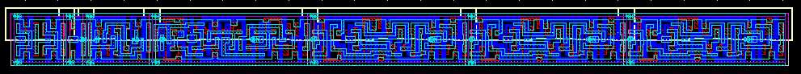 </p><BR>

Before we finish this placement step, we need to add to both ends of this layout a **tap cell**.  The tap cell connects the n-well (for p-type transistors) to the VDD power rail, and the p-well (for n-type transistors) to VSS (i.e. GND). Tap cells are NOT included in the Verilog netlist.  In Lab 1, you instructed ***_Innovus_** to add tap cells this automatically with the **_"Addwelltap"_** command. Here you are doing this manually.

Use the **"i"**  command to insert an instance. This will pop up a **"Create Instance"** dialogue box. Fill this in as shown below:

<p align="center"> 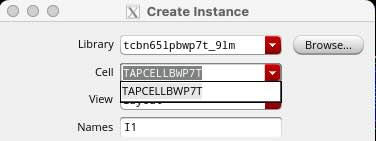 </p><BR>

Now place a tap cell on each end of the row of cells to provide connections to VDD and VSS. (You need to click twice!)  Align them precisely using the **_"a"_** alignment command.

**_Step 7: Design Rule Check (DRC) on the Placement_**

To make sure that your placement effort has not violated any design rules (e.g. misaligning a cell relative to its neighbour), you should now use the **_Calibre_** verification tool to perform a design rule check (DRC) on this layout so far.

1. In the layout window, use the command **_Calibre -> run nmDRC_** to bring up the Calibre DRC dialogue box.
2. Click the **_Rules_** tab.
3. Enter the DRC rules location: **_/usr/local/cadence/kits/tsmc/65n_LP/Calibre/drc/calibre_density_off.drc_**.
4. Click **LOAD** button to load it into your working environment.
5. Specify where the lfsr4 layout is stored.
6. Click the **RUN** button on the left.
   
   <p align="center"> 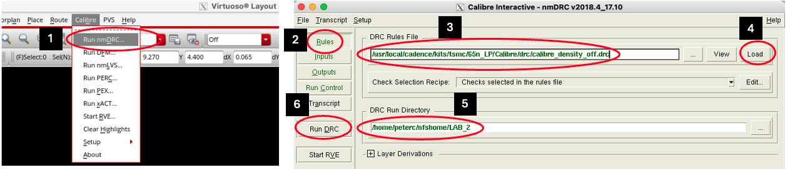 </p><BR>

Several window will pop up including the **_Calibre RVE_** window that shows any DRC rule violations.  Double click on each will expose an explanation on what the violation is.  Select the violation and use the **"h"** command to hightlight the violation on the layout itself.

> Try this and explore the DRC report.


### Task 4 - Hand Route the standard cells (60 min)

The next task is to connect all these cells according to the following wiring diagram. 

<p align="center"> 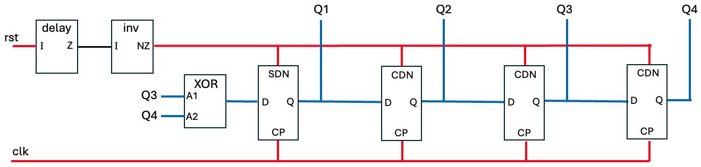 </p><BR>

The floorplan of this circuit was designed to minimize the length of wires to connect up the circuit.

There are three type of connections:
1. **Neighbourhood wires** (black) - These are the easy connections between the output of one cell on the right boundary to the input of the next cell on the left boundary.  They can be wired up using ONLY metal 1 (M1) without requiring any vias.  
2. **Clock & control wires** (red) - These are wires that control flip-flops.  In Lab 1 PnR process, clock tree synthesis came before routing.  Here you should wire up the clock signal before the reset signals. 
3. **Signal wires** (blue) - These are internal wires that connect cells that are not conveniently located and will have to go out to the routing channel via metal 2 layer (M2).

Before you start to hand route the circuit, discuss with your lab partner the wiring up strategy. You should also be aware of the design rule that you need to follow.  You can find out the exact rules for the TSMC process you are using.  These rules are propietary and therefore cannot be included here.  However, the table below is generated with the help of ChatGPT and is in the public domain. They are guidelines only and available for educational purpose.  The exact rules can be found in the documentation section of the PKD. 

>While the table provides the key dimensions, those highlighted in green are the ones that are relevant the hand routing task.

<p align="center"> 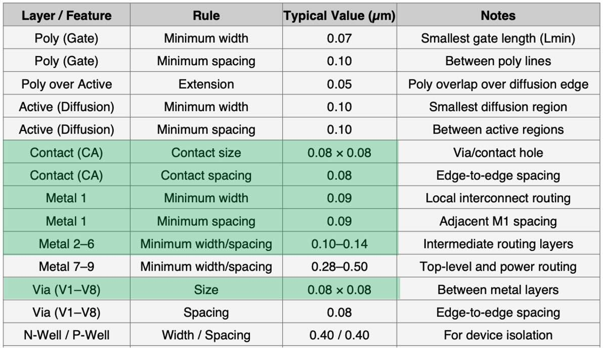 </p><BR>

**_Step 1: Practice layout editing for wiring_**

Manually connecting a circuit is tedious and easy to make an error. However, it is also a vital skill to learn in full-custom VLSI design.  Before you wire up the circuit, this step is to learn how to create wires of certain dimension and check for DRC violations each step of the way.

* Turn on realtime rule checking with the command: **_Option -> DRD Edit_**, and Tick **_Notify Enabled_**.
* In the layout window and away from the row of placed cells, draw a M1 rectangle of arbitrary size using the **"r"** command after selecting M1 layer.
* Select the M1 rectangle and use the **"q"** command to bring up the property dialogue box (for this rectangle).
* Change the rectangle size to: height = 0.1, width = 0.5. The unit is in micron.
* Draw another rectangle close by and you will see how the realtime DRC works as shown below.
* In the layer selection window, turn on all valid layers and select M2 drw layer. Create a verticle M2 wire of dimension 0.1 x 0.3. Align the M1 and M2 wire as shown.  These two wire represent a typing signal from a standard cell being routed to elsewhere in the routing channel.
* Select the M2 wire and use the **_o_** command to create a via.  A **_Create Via_** dialogue window will pop up. Select the **_Auto_** mode as shown.
* Click on the overlap betwween M1 and M2 wires to indicate that this is where you want a M1 to M2 via should be created.
  
You have now successfully connecting vertical M2 wire to a horizontal M1 wire. 

> Use **_"k"_** command to measure all the dimension and label this simple layout segment with the measured dimensions.  You can remove the measurements with **_SHIFT-k_**.
> Leave this exercise layers in place, so that you can see the used layers that include M2 layer.  Delete this exercise wires after the routing is completed.

<p align="center"> 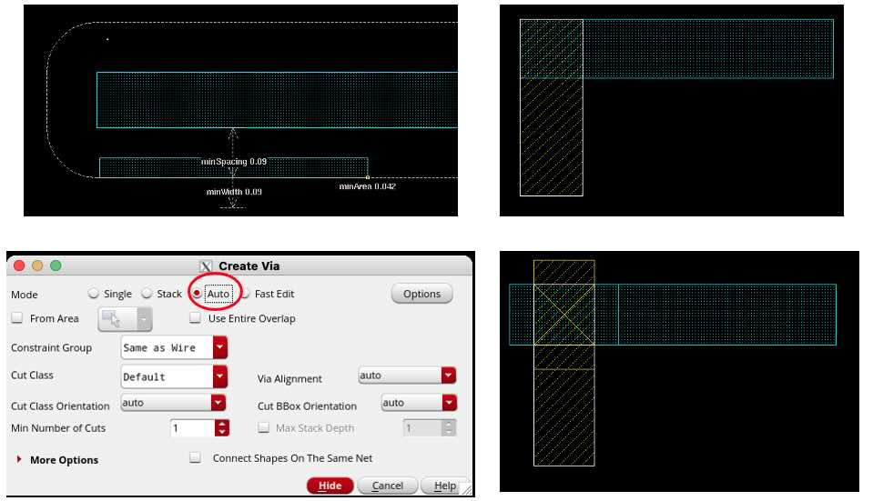 </p><BR>

**_Step 2: Connecting Neighbouring wires_**

There is only one neighbourhood wires, one from output of the delay cell to the inverter.  
* Identify the local of the output pin Z of the delay cell and the input pin I of the inverter cell.
* Select the layer to draw - in this case, M1.
* Use the **_"r"_** shortcut command and draw a M1 rectangle overlapping the two M1 pins.  Make sure that you obey the design rules shown in the table.
* Run the Calibre nmDRC check to confirm that you have not introduced any DRC violation.


**_Step 2: Routing the clock signal_**

* Indentify all the clock pins for the flip-flops (CP).
* Draw a horizontal wire in M1 for the clock signal above (or below) the row of cells. Ensure that the wire is at least minimum width and distance from the power M1 wire.
* Place M2 onto the CP pins for all four flip-flops, covering both the M1-poly via and the M1 pin metal. 
* Add M1-M2 vias using the method you practised before at the CP pin locations.
* Connect the CP pins using M2 wire to the M1 horizontal wire in the routing channel you created earlier.
* Add M1-M2 vias connecting the M2 wire to the horizontal clock wire.
* Do another DRC check.

**_Step 3: Routing the reset signal_**

* Create M1 horizontal wire for the reset signal.
* Connect the resest signals of each flip-flop to the reset wire as in the clock signal.
* Do another DC check.

**_Step 4: Wire up the internal signals_**

There are several internal signals including four output siganls Q[4:1].  Note that Cadence uses the syntax Q<4:1> instead. Wire these as you see fit.  Bring the four output signals to the right of the row of cells.

**_Step 5: Connect the pins_**

Somewhere on the layout are all the pins (ports) associated with LFSR4. Place these pins onto their corresponding wires. Then perform the final DRC check.

### Task 5 - Perform Layout vs Schematic (LVS) check (5 min)

The final task is to confirm that the layout you created implements the circuit specified by the imported schematic. The steps are similar to DRC. 

* Use the command: **_Calibre -> nmLVS>** to bring up the LVS dialogue window.
* Enter the location of LVS rule file as: **_/usr/local/cadence/kits/tsmc/65n_LP/Calibre/lvs/calibre.lvs_** and press **_LOAD_**.
* Run LVS and there should be no error.

Since the layout matches that of the schematic, which was imported from Lab 1 and was previously verified to be functionally correct through simulation, we are confident that this LFSR4 layout works as intended.
